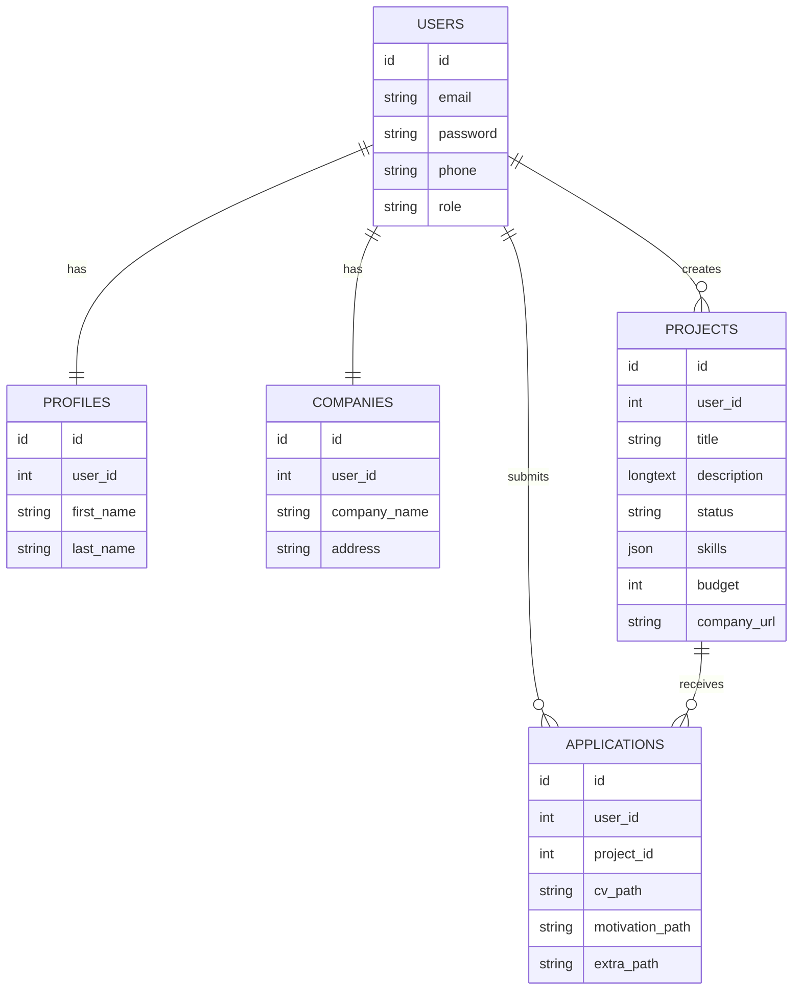

# Freelance Application Platform
* **Live Demo:** [Freelance Platform](https://freelance-platform-sigma.vercel.app/)

A modern, full-stack web application designed to bridge the gap between freelancers and recruiters. This platform focuses on **scalability, high-security standards, and an intuitive user experience.**

###  User Workflows
The platform implements distinct journeys based on user roles:

* **Freelancer Journey:**
    * **Discovery:** Browse and search projects by title or specific skill tags.
    * **Application:** Streamlined application process with pre-filled email and multi-file document upload (CV, Cover Letter, Portfolio).
    * **Management:** Track application history, status, and project details via a dedicated "My Applications" tab.
    * **Profile:** Centralized profile management (contact info, credentials, and password security).

* **Recruiter Journey:**
    * **Lifecycle Management:** Projects are managed via three states: **Pending** (under review), **Approved** (Live), and **Rejected**.
    * **Collaboration:** Integrated application management allowing recruiters to view candidate lists, including candidate names, dates of application, and direct secure downloads for all submitted documents.
    * **Project Control:** Full CRUD capabilities for projects. Note: Any modification to an approved project triggers a re-moderation process.

* **Admin Journey:**
    * **Moderation:** Centralized dashboard for pending project reviews.
    * **Decision Engine:** Ability to Approve, Reject, or Re-evaluate projects. The system allows for "Force Approve" or "Reconsider" workflows to handle edge cases.
    * **Archive Control:** Full visibility over the live and historical project database.
## 🏗 System Architecture

The application utilizes a **decoupled architecture**, separating the frontend and backend for maximum flexibility and performance.

### 1. Backend (Laravel 12 API)
* **Security & Auth:** Implemented **Laravel Sanctum** for secure token-based authentication and role-based access control (RBAC) handling `freelancer`, `recruiter`, and `admin` roles.
* **Cloud-Native Storage:** Instead of local storage, the platform uses **Cloudflare R2 (S3-compatible)**. This makes the backend "stateless," allowing for easy deployment across cloud infrastructures.
* **Efficient Data Handling:** Implemented a `readStream` mechanism for document downloads, ensuring memory-efficient handling of large files without server strain.

### 2. Frontend (Next.js 16 + React 19 + TypeScript)
* **Type Safety:** The entire frontend is developed using TypeScript, ensuring strict type checking, reduced runtime errors, and better developer productivity through enhanced IDE autocompletion.
* **Session Security:** Custom server-side `proxy` middleware validates authentication tokens before rendering protected routes.
* **State Management:** Robust `AuthContext` provides real-time user session management across the entire application.
* **Enhanced UX:** * **Modular Notifications:** Centralized `notify` service using `sonner`.
    * **Intuitive UI:** Custom "Inline Confirmation" states for destructive actions, replacing standard browser alerts with modern, animated components.
    * **Responsiveness:** Fluid design using Tailwind CSS for a consistent mobile-to-desktop experience.

## 🛠 Key Features

* **Role-Based Dashboards:** Optimized views for different user roles.
* **Admin Management:** Advanced project control panel for status updates (pending/approved/rejected) with instantaneous UI feedback.
* **Search & Filter:** Intelligent filtering system available across all dashboards based on project titles and required skills.
* **Optimized Navigation:** Fully responsive mobile menu with seamless transitions.
* **Storage:** Files are managed through a secure S3-compatible stream, ensuring sensitive candidate documents are only accessible to authorized recruiters.

## 🚀 Tech Stack

| Component | Technology |
| :--- | :--- |
| **Frontend** | Next.js 16, React 19, TypeScript, Tailwind CSS |
| **Backend** | Laravel 12, PHP 8.x |
| **Storage** | Cloudflare R2 (S3 API) |
| **Auth** | Laravel Sanctum |
| **Notifications**| Sonner |

### 📊 Database Schema (ERD)

## ⚙️ Quick Start

### Backend
1. Clone the repository.
2. Set up your `.env` file with `FILESYSTEM_DISK=s3` and your R2 credentials.
3. Run migrations: `php artisan migrate`.

### Frontend
1. Install dependencies: `npm install`.
2. Configure `NEXT_PUBLIC_API_URL` in your `.env`.
3. Start the dev server: `npm run dev`.

---

*This project demonstrates a production-ready approach to full-stack development, focusing on modularity, security, and performance.*